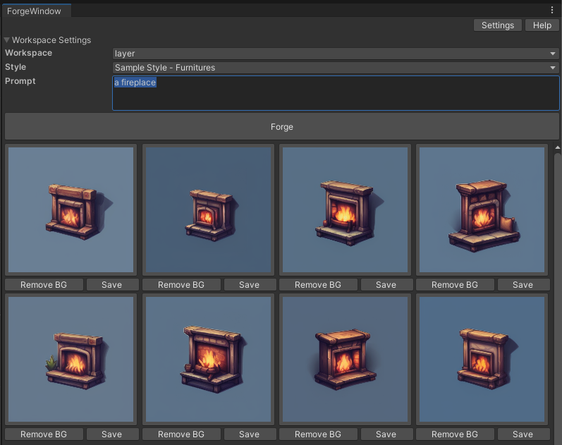

# Layer Unity SDK

## Installation
- Download the [Layer SDK package](https://github.com/layerai/unity-plugin/raw/main/layersdk.unitypackage) to your computer
- Open your Unity project
- Double click/Open the Layer SDK

## Settings
- Open Window > Layer AI > Settings
- Click [Create your access token](https://app.layer.ai/settings/tokens)
- Copy & paste your access token
- Hit save!
